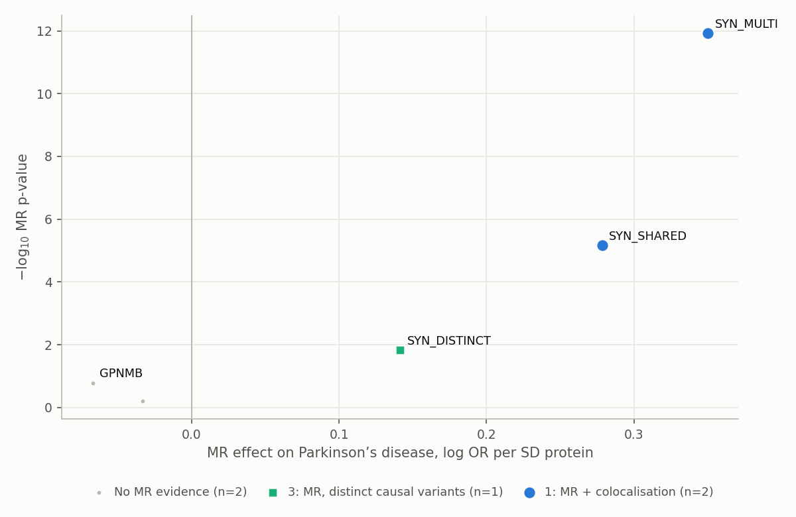
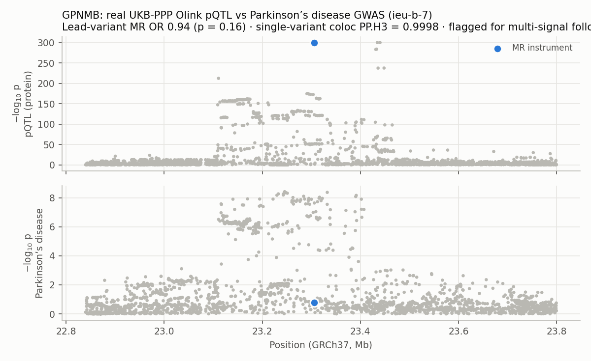

# Proteome-wide cis-MR and colocalisation scan for Parkinson's disease

A Nextflow pipeline that tests every plasma protein in the UK Biobank Pharma Proteomics Project (UKB-PPP, ~2,900 Olink proteins) as a potential cause of Parkinson's disease. For each protein it uses variants near the protein's own gene (cis-pQTLs) as genetic instruments, estimates the causal effect on PD risk with Mendelian randomisation (MR), and tests with colocalisation whether the protein and PD share the same causal variant. Proteins are FDR-corrected, sorted into evidence tiers and summarised in an HTML report.

This extends my MSc dissertation, which assessed a single protein ([GPNMB](https://github.com/barbavegeta/GPNMB-Parkinson-MR-Colocalisation)), into the scalable target-prioritisation workflow used by human-genetics teams in drug discovery.



## What it does

```
UKB-PPP pQTLs (per protein) ─┐
                             ├─ cis window (gene ± 500 kb, GRCh38) → QC (INFO, MAF)
PD GWAS (ieu-b-7, GRCh37) ───┘        │
                                      ├─ harmonise alleles on GRCh37 position (strand flips, palindromes)
                                      ├─ instruments: p < 5e-8, F ≥ 10, LD-clumped (r² < 0.001) on 1000G EUR
                                      ├─ MR: Wald ratio / IVW (fixed + random effects), MR-Egger, weighted median
                                      └─ coloc ABF (p1 = p2 = 1e-4, p12 = 1e-5) + prior sensitivity
                                                       │
            all proteins → Benjamini–Hochberg FDR → evidence tiers → HTML report
```

| Tier | Rule | Meaning |
|---|---|---|
| 1 | MR q < 0.05 and PP.H4 ≥ 0.8 | Protein and PD most likely share one causal variant |
| 2 | MR q < 0.05 and PP.H4 0.5–0.8 | Supportive, not conclusive |
| 3 | MR q < 0.05 and PP.H3 ≥ 0.5 | Different causal variants: MR probably reflects LD, not the protein |
| 4 | MR q < 0.05, coloc inconclusive | Usually an underpowered outcome signal |

Each protein runs as an independent Nextflow task, so the scan parallelises across a laptop's cores or an HPC/cloud cluster.

## Validation against R

The statistics are implemented in Python (NumPy/SciPy) and checked against the reference R packages. The test suite reproduces the R results from my dissertation to at least 8 significant figures:

| Check | R result (dissertation) | This pipeline |
|---|---|---|
| `coloc.abf`, SomaScan GPNMB vs PD (150 SNPs) | PP.H4 = 0.943955 | PP.H4 = 0.943955 |
| `coloc.abf`, UKB-PPP Olink GPNMB vs PD (4,018 SNPs) | PP.H3 = 0.999804 | PP.H3 = 0.999804 |
| coloc prior sensitivity (7 values of p12) | matches | matches |
| IVW fixed + multiplicative random effects, Cochran's Q (3 clumping settings) | e.g. OR 1.079, RE p = 0.473 | identical |
| Wald ratio, lead variant rs75801644 | β = −0.06717, SE 0.04832 | identical |

Run them with `python -m pytest -q` (14 tests). `validation/cross_check_with_R.R` repeats the coloc comparison with `coloc::coloc.abf` for any protein from a pipeline run.

## Test run

```bash
pip install -r requirements.txt
nextflow run main.nf -profile test
```

The test data combine the **real GPNMB locus** (UKB-PPP Olink pQTL and ieu-b-7 PD GWAS) with four **simulated proteins**, each built to land in a known tier. They were simulated from a genotype panel so LD, clumping and colocalisation behave realistically:

| Protein | Scenario | Result |
|---|---|---|
| SYN_SHARED | one causal pQTL that also drives PD | Tier 1 (OR 1.32, PP.H4 0.99) |
| SYN_MULTI | three independent causal pQTLs, all mediated by the protein | Tier 1, 3 instruments (OR 1.42, PP.H4 1.00) |
| SYN_DISTINCT | PD signal from a nearby variant in LD | Tier 3 (MR p = 0.014, PP.H3 1.00) |
| SYN_NULL | pQTL with no effect on PD | No MR evidence (PP.H1 0.99) |
| GPNMB (real) | see below | No MR evidence at the lead variant; flagged for multi-signal follow-up |

Outputs: `results_test/scan_results.tsv`, `results_test/pd_proteome_mr_report.html` and `pipeline_info/`. A copy is in [`docs/example_results/`](docs/example_results/).



GPNMB shows why the tiers and flags are there. The strongest Olink pQTL is a low-frequency variant (rs75801644) with no PD association, so lead-variant MR is null and single-variant colocalisation strongly prefers distinct signals (PP.H3 = 0.9998). But the pQTL has several independent signals, and PD's association peak lies over them. In my dissertation, SuSiE-based colocalisation found a secondary pQTL signal shared with PD. The pipeline flags such loci (`H3_at_PD_locus_check_multi_signal`) instead of discarding them.

## Running on real data

1. **PD GWAS.** Download `ieu-b-7.vcf.gz` (Nalls et al. 2019, excluding 23andMe; 33,674 cases, 449,056 controls) from the IEU OpenGWAS project.
2. **LD reference.** 1000 Genomes Phase 3 EUR PLINK files (GRCh37), either as one genome-wide set or per chromosome (use `{chr}` in the prefix, e.g. `ref/EUR_chr{chr}`).
3. **pQTLs.** UKB-PPP European discovery summary statistics are on Synapse, one tar per protein, well over a terabyte in total. `scripts/fetch_ukbppp_cis.py` streams them: it downloads one protein, keeps only the cis window, deletes the tar and moves on. A sensible first pass is the proteins near PD risk loci:

```bash
python bin/prepare_outcome.py --gwas ieu-b-7.vcf.gz --outdir outcome_by_chr
python scripts/select_proteins_near_pd_loci.py --outcome-dir outcome_by_chr \
    --protein-map assets/olink_protein_map_3k_v1.tsv --out proteins_pd_loci.txt
export SYNAPSE_AUTH_TOKEN=...            # after accepting the UKB-PPP data terms
python scripts/fetch_ukbppp_cis.py --folder-id <synapse folder> \
    --protein-map assets/olink_protein_map_3k_v1.tsv --proteins proteins_pd_loci.txt \
    --outdir data/ukbppp_cis
python scripts/build_samplesheet.py --protein-map assets/olink_protein_map_3k_v1.tsv \
    --sumstats-dir data/ukbppp_cis --out samplesheet.csv

nextflow run main.nf --samplesheet samplesheet.csv --outcome ieu-b-7.vcf.gz \
    --ld_ref ref/EUR_chr{chr} --outdir results_pd
```

Leave out `--proteins` to fetch the whole proteome. Use `-profile slurm` on a cluster, `-profile docker` (build with `docker build -t pd-proteome-mr-scan:0.1.0 .`) or `-profile conda`. Every threshold can be set on the command line (`--window_kb`, `--p_threshold`, `--clump_r2`, `--p12`, `--fdr`; see `nextflow.config`).

## Repository layout

```
main.nf, nextflow.config     pipeline and profiles (test, docker, conda, slurm)
bin/                         CLI steps called by Nextflow
src/pdmr/                    library: io, harmonise, clump, mr, coloc, ranking, plots, report
scripts/                     data preparation (UKB-PPP fetch, samplesheet, PD-locus selection, test data)
tests/                       validation against R, unit and end-to-end tests, fixtures
validation/                  R cross-check script
assets/                      UKB-PPP Olink protein map (gene coordinates, GRCh38)
```

## Limitations

- Colocalisation assumes one causal variant per trait in the region. Loci with several pQTL signals need SuSiE-based colocalisation, which requires an LD matrix. That is the next planned extension.
- cis-MR assumes the instruments affect PD only through the protein. Protein-altering variants can change how the Olink antibodies bind (epitope effects) without changing protein level.
- The results are genetic prioritisation evidence, not proof of causality or druggability.

## Data and citations

UKB-PPP: Sun BB et al. *Nature* 2023. PD GWAS: Nalls MA et al. *Lancet Neurol* 2019 (ieu-b-7 via IEU OpenGWAS). Colocalisation: Giambartolomei C et al. *PLoS Genet* 2014. MR methods: Burgess S et al. 2013; Bowden J et al. 2015, 2016. The test fixtures under `tests/fixtures/` are derived from these public summary statistics.
